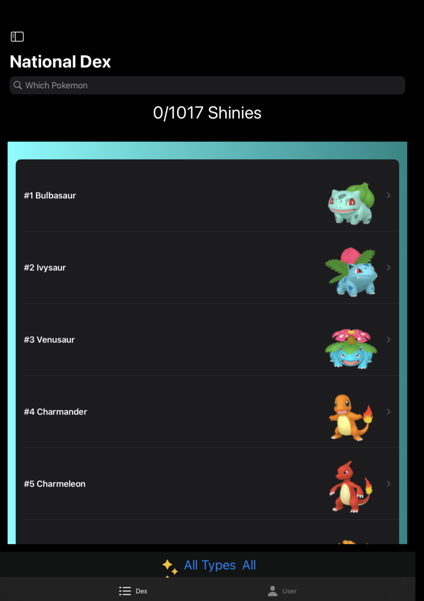

#  PokeBase
## A iOS Mobile App to help people track their Shiny Pokemon Easily!

## Description: 
    - This Project is For Pokemon Fans who wanted a simplier way to track their shiny collection and which game to retrieve them
    - This Project is mainly written in SwiftUI  

## Architecture: 
    - PokeBase was implemented using Model-View-ViewModel (MVVM) architecture pattern
    - Model Folder contains all generated data and business logic needed to run the app and store the User data
    - ViewModel Folder abstracts all the user interactions and input from the View and update the Model and View as needed
    - View Handles all the displaying of the User Shiny Pokemon and being able to gather all the necessary 
    - Project is currently not implemented with a external database but stores data in the iOS Document Storage 

## Design:
    Currently Design and Page layout are done on a simplified bases through the App
     - Hire a UI/UX designer to review necessary changes

## Dependencies:
    CocoaPods is used as a dependency manager. 
    - Only dependency is SwiftCSV
